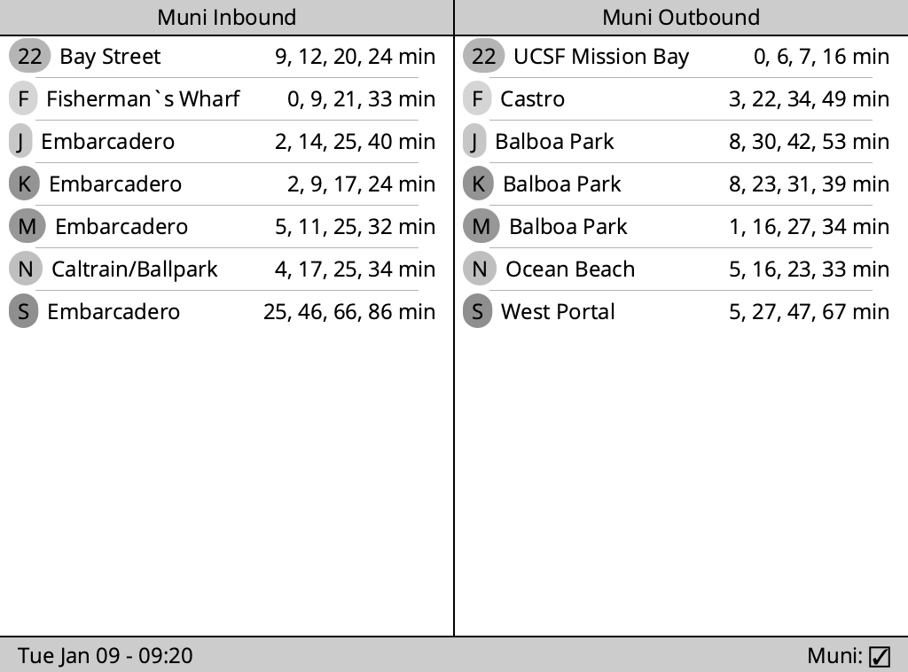

# SF Transit Kindle



Turn your old Kindle into a dashboard for upcoming transit departure times!
Powered by the 511.org API, this flexible system should be able to display times
for any of the transit agencies in the San Francisco Bay Area.

This is a Rust HTTP server which produces PNG image data that a Kindle can fetch
via `wget`, then display via `eips`.

## Configuration

You will need to create a config file in the working directory called
`stops.yml`. Look at `stops-example.yml` for an example configuration file.

## Running

You do not need to provide any command-line arguments to the server, just start
it and it will immediately begin listening on port 3001. The server provides the
following HTTP routes:

```
/kindle.png ==> Renders the dashboard formatted for a Kindle display
/stops.html ==> A HTML page that shows the dashboard
/browser.png => Renders the dashboard for a browser (the Kindle image is rotated, the browser image is not)
```

## Inspiration

This project was inspired by [Matt Healy's 2021 blog
post](https://matthealy.com/kindle) on building a smart home display with a
Kindle. Matt used an old Kindle to display things like weather, calendar events,
meal plans, and house cleaning schedules. I figured I could probably adapt his
guide and make myself an always-available display of upcoming transit departures
at the stops nearest to my apartment.
